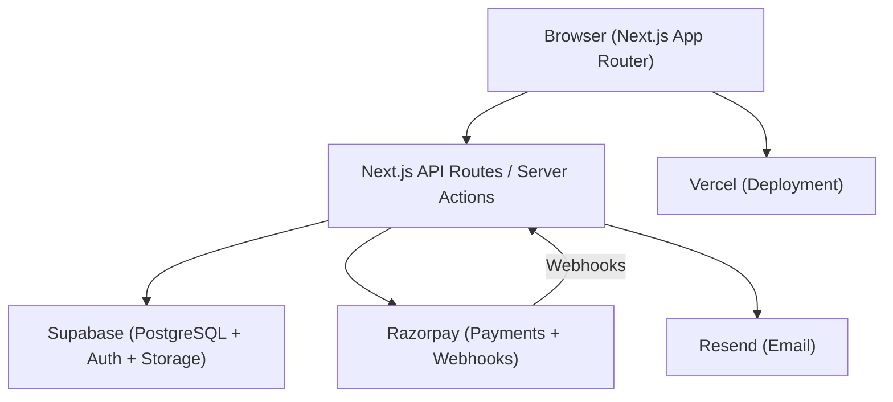

# Design Document: Golf Charity Subscription Platform

## Overview

The Golf Charity Subscription Platform is a full-stack web application built with Next.js (App Router), Supabase (PostgreSQL + Auth + Storage), and Razorpay. It combines golf performance tracking, a monthly draw engine, and charitable giving into a single emotionally engaging product.

The stack is chosen for rapid deployment to Vercel, native Supabase integration, and a clean TypeScript codebase that can be extended to a mobile app (React Native) in the future.

**Tech Stack:**
- Frontend: Next.js 14 (App Router), TypeScript, Tailwind CSS, Framer Motion
- Backend: Next.js API Routes / Server Actions, Supabase Edge Functions
- Database & Auth: Supabase (PostgreSQL + Row Level Security + Auth)
- Payments: Razorpay (Subscriptions + Webhooks)
- Email: Resend (transactional email)
- Deployment: Vercel (frontend + serverless), Supabase (database + storage)
- Testing: Vitest (unit + property), fast-check (property-based testing)

---

## Architecture



### Request Flow

1. Browser sends authenticated request with JWT (Supabase Auth token)
2. Next.js middleware validates the token on every request
3. API routes / Server Actions interact with Supabase via the service role client
4. Razorpay webhooks hit a dedicated `/api/webhooks/razorpay` endpoint to update subscription state
5. Email notifications are dispatched via Resend from server-side handlers

---

## Components and Interfaces

### Authentication Module
- `supabase.auth.signUp()` / `signInWithPassword()` for registration and login
- Supabase Auth handles JWT issuance and refresh
- Next.js middleware (`middleware.ts`) validates session on every protected route

### Subscription Module
- `POST /api/subscriptions/create` — creates a Razorpay subscription/order session
- `POST /api/webhooks/razorpay` — handles `payment.captured`, `payment.failed`, `subscription.cancelled`
- Subscription state stored in `subscriptions` table, synced via webhooks

### Score Module
- `POST /api/scores` — validates and inserts a new score; enforces rolling 5-score window
- `PUT /api/scores/:id` — updates an existing score with same validation
- `GET /api/scores` — returns scores for the authenticated user, ordered by date descending

### Draw Engine Module
- `POST /api/admin/draws/simulate` — runs draw in preview mode, returns results without persisting
- `POST /api/admin/draws/publish` — persists draw results and triggers notifications
- Draw logic: `lib/draw-engine.ts` — exports `runRandomDraw()` and `runAlgorithmicDraw()`

### Prize Pool Module
- `lib/prize-pool.ts` — exports `calculatePrizePool()` and `distributePrizes()`
- Jackpot rollover tracked in `draws` table via `jackpot_carried` column

### Charity Module
- `GET /api/charities` — paginated list with search/filter
- `GET /api/charities/:id` — individual charity profile
- `POST /api/admin/charities` — create charity (admin only)
- `PUT /api/admin/charities/:id` — update charity
- `DELETE /api/admin/charities/:id` — delete charity

### Winner Verification Module
- `POST /api/winners/:id/proof` — subscriber uploads proof screenshot
- `PUT /api/admin/winners/:id/verify` — admin approves or rejects
- `PUT /api/admin/winners/:id/payout` — admin marks payout as completed

### Dashboard Module
- `GET /api/dashboard` — aggregated user dashboard data (subscription, scores, charity, draws, winnings)
- `GET /api/admin/dashboard` — aggregated admin analytics

---

## Data Models

```sql
-- Users (managed by Supabase Auth, extended via profiles)
CREATE TABLE profiles (
  id UUID PRIMARY KEY REFERENCES auth.users(id),
  full_name TEXT,
  email TEXT UNIQUE NOT NULL,
  role TEXT NOT NULL DEFAULT 'subscriber', -- 'subscriber' | 'admin'
  charity_id UUID REFERENCES charities(id),
  charity_contribution_pct INTEGER NOT NULL DEFAULT 10, -- percentage, min 10
  created_at TIMESTAMPTZ DEFAULT NOW()
);

-- Subscriptions
CREATE TABLE subscriptions (
  id UUID PRIMARY KEY DEFAULT gen_random_uuid(),
  user_id UUID NOT NULL REFERENCES profiles(id),
  razorpay_subscription_id TEXT UNIQUE,
  razorpay_customer_id TEXT,
  plan TEXT NOT NULL, -- 'monthly' | 'yearly'
  status TEXT NOT NULL, -- 'active' | 'cancelled' | 'lapsed' | 'past_due'
  current_period_end TIMESTAMPTZ,
  created_at TIMESTAMPTZ DEFAULT NOW(),
  updated_at TIMESTAMPTZ DEFAULT NOW()
);

-- Golf Scores
CREATE TABLE scores (
  id UUID PRIMARY KEY DEFAULT gen_random_uuid(),
  user_id UUID NOT NULL REFERENCES profiles(id),
  score INTEGER NOT NULL CHECK (score >= 1 AND score <= 45),
  played_on DATE NOT NULL,
  created_at TIMESTAMPTZ DEFAULT NOW()
);

-- Charities
CREATE TABLE charities (
  id UUID PRIMARY KEY DEFAULT gen_random_uuid(),
  name TEXT NOT NULL,
  description TEXT,
  image_url TEXT,
  is_featured BOOLEAN DEFAULT FALSE,
  created_at TIMESTAMPTZ DEFAULT NOW()
);

-- Charity Events
CREATE TABLE charity_events (
  id UUID PRIMARY KEY DEFAULT gen_random_uuid(),
  charity_id UUID NOT NULL REFERENCES charities(id),
  title TEXT NOT NULL,
  event_date DATE NOT NULL,
  description TEXT
);

-- Draws
CREATE TABLE draws (
  id UUID PRIMARY KEY DEFAULT gen_random_uuid(),
  month DATE NOT NULL, -- first day of the draw month
  mode TEXT NOT NULL, -- 'random' | 'algorithmic'
  drawn_numbers INTEGER[] NOT NULL, -- 5 numbers
  status TEXT NOT NULL DEFAULT 'draft', -- 'draft' | 'simulated' | 'published'
  prize_pool_total NUMERIC(12,2) NOT NULL DEFAULT 0,
  jackpot_carried NUMERIC(12,2) NOT NULL DEFAULT 0, -- rolled over from previous month
  created_at TIMESTAMPTZ DEFAULT NOW(),
  published_at TIMESTAMPTZ
);

-- Draw Winners
CREATE TABLE draw_winners (
  id UUID PRIMARY KEY DEFAULT gen_random_uuid(),
  draw_id UUID NOT NULL REFERENCES draws(id),
  user_id UUID NOT NULL REFERENCES profiles(id),
  match_tier INTEGER NOT NULL, -- 3 | 4 | 5
  prize_amount NUMERIC(12,2) NOT NULL,
  verification_status TEXT NOT NULL DEFAULT 'pending_proof', -- 'pending_proof' | 'pending_review' | 'approved' | 'rejected'
  payment_status TEXT NOT NULL DEFAULT 'unpaid', -- 'unpaid' | 'pending' | 'paid'
  proof_url TEXT,
  created_at TIMESTAMPTZ DEFAULT NOW()
);

-- Donations (independent, not tied to subscription)
CREATE TABLE donations (
  id UUID PRIMARY KEY DEFAULT gen_random_uuid(),
  user_id UUID REFERENCES profiles(id),
  charity_id UUID NOT NULL REFERENCES charities(id),
  amount NUMERIC(12,2) NOT NULL,
  razorpay_payment_id TEXT,
  created_at TIMESTAMPTZ DEFAULT NOW()
);
```

---

## Correctness Properties

*A property is a characteristic or behavior that should hold true across all valid executions of a system — essentially, a formal statement about what the system should do. Properties serve as the bridge between human-readable specifications and machine-verifiable correctness guarantees.*

### Property-Based Testing Overview

Property-based testing (PBT) validates software correctness by testing universal properties across many generated inputs. Each property is a formal specification that should hold for all valid inputs. We use **fast-check** as the PBT library with a minimum of 100 iterations per property test.

---

Property 1: Score range validation
*For any* integer submitted as a Stableford score, the system should accept it if and only if it is between 1 and 45 inclusive; all other integers should be rejected with a validation error.
**Validates: Requirements 3.1, 3.6**

---

Property 2: Rolling 5-score window invariant
*For any* sequence of score submissions of length N (where N > 5), after all submissions the score log should contain exactly 5 scores, and those 5 scores should be the N most recently submitted scores in reverse chronological order.
**Validates: Requirements 3.3, 3.4, 3.5**

---

Property 3: Score storage round-trip
*For any* valid score (integer 1–45) and date, storing the score and then retrieving it should return the same score value and date.
**Validates: Requirements 3.2**

---

Property 4: Prize pool allocation invariant
*For any* total prize pool amount, the sum of the three tier allocations (40% + 35% + 25%) must equal the total prize pool amount, and each tier must receive exactly its specified percentage.
**Validates: Requirements 5.1, 5.2, 5.3, 5.4**

---

Property 5: Equal prize split among multiple winners
*For any* tier prize amount and any number of winners N (N >= 1) in that tier, each winner's prize share must equal tier_amount / N, and the sum of all shares must equal the tier_amount.
**Validates: Requirements 5.5**

---

Property 6: Jackpot rollover accumulation
*For any* sequence of monthly draws where no 5-Number Match winner exists, the 5-Number Match pool for month M should equal the sum of all unclaimed 5-Number Match pools from all previous months plus the current month's 40% allocation.
**Validates: Requirements 4.7, 5.6**

---

Property 7: Charity contribution minimum enforcement
*For any* subscription fee amount, the charity contribution amount must be greater than or equal to 10% of that fee amount.
**Validates: Requirements 6.2**

---

Property 8: Charity contribution update round-trip
*For any* valid contribution percentage (10–100), setting a subscriber's charity contribution percentage and then retrieving it should return the same percentage.
**Validates: Requirements 6.3**

---

Property 9: Subscription state machine validity
*For any* subscription, the status must always be one of the valid states ('active', 'cancelled', 'lapsed', 'past_due'), and transitions must only occur in the defined directions (active → cancelled, active → past_due → lapsed).
**Validates: Requirements 2.3, 2.4, 2.5, 2.6, 2.7**

---

Property 10: Authentication token round-trip
*For any* registered user with valid credentials, authenticating should produce a token, and that token should be accepted as valid on subsequent authenticated requests.
**Validates: Requirements 1.3, 1.4**

---

Property 11: Duplicate registration prevention
*For any* email address already registered in the system, attempting to register again with the same email should return an error and the total number of accounts with that email should remain exactly 1.
**Validates: Requirements 1.2**

---

Property 12: Draw match tier correctness
*For any* set of 5 drawn numbers and any subscriber's score log, the match tier assigned to that subscriber should equal the count of their scores that appear in the drawn numbers, and the tier should only be recorded if the count is 3, 4, or 5.
**Validates: Requirements 4.3**

---

Property 13: Winner verification state transitions
*For any* draw winner record, the verification_status must only transition in the valid direction: pending_proof → pending_review → approved or rejected; and payment_status must only transition: unpaid → pending → paid.
**Validates: Requirements 7.1, 7.2, 7.3, 7.4, 7.5, 7.6**

---

## Error Handling

- All API routes return structured JSON errors: `{ error: string, code: string }`
- Validation errors return HTTP 400 with field-level detail
- Authentication errors return HTTP 401
- Authorization errors (non-admin accessing admin routes) return HTTP 403
- Not found errors return HTTP 404
- Razorpay webhook signature verification failures return HTTP 400
- Unhandled server errors return HTTP 500 and are logged (never expose stack traces to clients)
- Score validation: out-of-range or missing date returns 400 with descriptive message
- Subscription access: non-subscriber accessing protected feature redirects to `/subscribe`

---

## Testing Strategy

### Dual Testing Approach

Both unit tests and property-based tests are required and complementary:

- **Unit tests** (Vitest): verify specific examples, edge cases, error conditions, and integration points
- **Property tests** (Vitest + fast-check): verify universal properties hold across all generated inputs

### Property-Based Testing Configuration

- Library: **fast-check**
- Minimum iterations: **100 per property test**
- Each property test references its design document property number
- Tag format in test comments: `Feature: golf-charity-platform, Property N: <property_text>`

### Test Organization

```
src/
  lib/
    score-engine.ts
    score-engine.test.ts        # unit + property tests for score logic
    draw-engine.ts
    draw-engine.test.ts         # unit + property tests for draw logic
    prize-pool.ts
    prize-pool.test.ts          # unit + property tests for prize calculations
    charity.ts
    charity.test.ts             # unit + property tests for charity contribution
  app/
    api/
      scores/
        route.test.ts           # integration tests for score API
      subscriptions/
        route.test.ts           # integration tests for subscription API
      winners/
        route.test.ts           # integration tests for winner verification
```

### Unit Test Focus Areas
- Score validation boundary values (0, 1, 45, 46)
- Rolling window edge cases (exactly 5 scores, 6th score replacement)
- Prize pool calculation with specific subscriber counts
- Draw match tier assignment with known inputs
- Subscription state transition logic
- Winner verification state machine

### Property Test Focus Areas
- All 13 correctness properties listed above
- Each implemented as a single fast-check property test
- Generators constrained to valid input domains (e.g., scores: `fc.integer({ min: 1, max: 45 })`)
